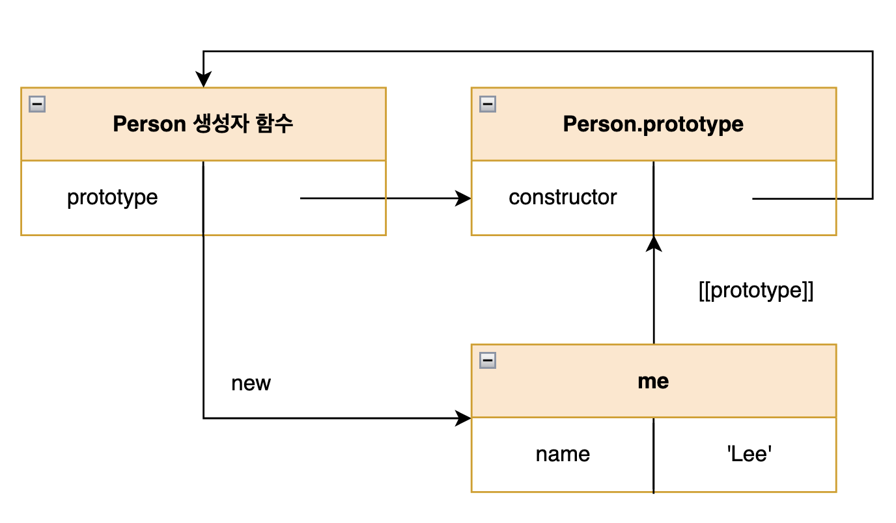

# 19.프로토타입

자바스크립트는 명령형(imperative), 함수형(functional),프로토타입 기반(prototype-based) 객체지향 프로그래밍(Object Ori-ented Programming)을 지원하는 멀티 패러다임 프로그래밍 언어이다.

**자바스크립트를 이루고 있는 거의 “모든 것이” 객체**

## 19.1 객체 지향 프로그래밍

### ✅ 객체 지향 프로그래밍이란 ?

프로그램을 명령어 또는 함수의 목록으로 보는 전통적인 명령형 프로그래밍의 절차지향적 관점에서 벗어나 여러 개의 독립적 단위, 즉 객체의 집합으로 프로그램을 표현하려는 프로그래밍 패러다임

### ✅ 추상화

프로그램에 필요한 속성만 간추려 내어 표현하는 것

### ✅ 객체

속성을 통해 여러 개의 값을 하나의 단위로 구성한 복합적인 자료구조

상태 데이터와 동작을 하나의 논리적인 단위로 묶은 복합적인 자료구조

객체는 자신의 고유한 기능을 수행하면서 다른 객체와 관계성을 가질 수 있음

## 19.2 상속과 프로토타입

### ✅ 상속

어떤 객체의 프로퍼티 또는 메서드를 다른 객체가 상속받아 그대로 사용할 수 있는 것

**자바스크립트의 경우 프로토타입으로 상속을 구현하여 불필요한 중복을 제거**

```jsx
// 객체가 생성될 때마다 동일한 내용의 getArea() 메서드 생성
function Circle(radius) {
  this.radius = radius;
  this.getArea = function () {
    return Math.PI * this.radius ** 2;
  };
}

// 프로토타입을 이용한 메서드
// 생성되는 모든 인스턴스는 하나의 getArea 메서드를 공유
// 중복소유는 메모리를 불필요하게 낭비
function Circle(radius) {
  this.radius = radius;
}

Circle.prototype.getArea = function () {
  return Math.PI * this.radius ** 2;
};
```

## 19.3 프로토타입 객체

### ✅ 프로토타입 객체

객체지향 프로그래밍의 근간을 이루는 객체 간 상속을 구현하기 위해 사용

어떤 객체의 상위 객체의 역할을 하는 객체로서 다른 객체에 공유 프로퍼티(메서드 포함)을 제공

객체가 생성될 때 객체 생성 방식에 따라 프로토타입이 결정되고 `[[prototype]]` 에 저장

모든 객체는 하나의 프로토타입을 갖고, 모든 프로토타입은 생성자 함수와 연결되어 있다.

### 🌟 proto 접근자 프로퍼티

1. `__proto__` 접근자 프로퍼티를 통해 자신의 프로토 타입, 즉 자신의 `[[prototype]]` 내부 슬롯이 가리키는 프로토타입에 `간접적`으로 접근 가능

   - getter/setter 함수라고 부르는 접근자 함수(`[[Get]]`, `[[Set]]`)를 통해 내부 슬롯의 값, 즉 프로토타입을 취득하거나 할당

   ```jsx
   const obj = {};
   const parent = { x: 1 };

   // getter 함수인 get __proto__가 호출되어 obj 객체의 프로토타입을 취득
   obj.__proto__;

   // setter 함수인 set __proto__가 호출되어 obj 객체의 프로토타입을 교체
   obj.__proto__ = parent;

   console.log(obj.x); // 1
   ```

2. 자신의 constructor 프로퍼티를 통해 생성자 함수에 접근할 수 있고, 생성자 함수는 자신의 prototype 프로퍼티를 통해 프로토타입에 접근 가능
   - 객체가 직접 소유하는 프로퍼티가 아니라 `Object.prototype`의 프로퍼티
3. **proto** 접근자 프로퍼티를 코드 내에서 직접 사용하는 것은 권장하지 않음
4. `__proto__`접근자 프로퍼티 대신 프로토타입의 참조를 취득하고 싶은 경우에는 `Object.getProtypeOf` 메서드를 사용하고, 프로토타입을 교체하고 싶은 경우에는 `Object.setPrototypeOf` 메서드를 사용할 것을 권장

### ✅ proto 접근자 프로퍼티를 통해 프로토타입에 접근하는 이유

➡️ 상호 참조에 의해 프로토타입 체인이 생성되는 것을 방지하기 위해서

```jsx
const parent = {};
const child = {};

child.__proto__ = parent;
parent.__proto__ = child; // TypeError: Cyclic__proto__value
```

- 프로토타입 체인은 단방향 링크드 리스트로 구현되어야 한다. ⇒ 프로퍼티 검색 방향이 한쪽 방향으로만 흘러가야 함
- 아무런 체크 없이 무조건적으로 프로토타입을 교체할 수 없도록 **proto** 접근자 프로퍼티를 통해 프로토타입에 접근하고 교체하도록 구현

### ✅ 함수 객체의 prototype 프로퍼티

➡️ 함수 객체만이 소유하는 prototype 프로퍼티는 `**생성자 함수가 생성할 인스턴스의 프로토타입**`을 가리킴

➡️ non-constructor인 화살표 함수와 ES6 메서드 축약 표현으로 정의한 메서드는 prototype 프로퍼티를 소유하지 않으며 프로토타입도 생성X

```jsx
// ES6의 메서드 축약 표현 => non-constructor
const obj = {
  foo() {},
};
```

모든 객체가 가지고 있는 **proto**접근자 프로퍼티와 함수 객체만이 가지고 있는 prototype 프로퍼티는 결국 동일한 프로토타입을 가리킨다. (사용 주체가 다름)

| 구분                      | 소유        | 값                | 사용 주체   | 사용 목적                                                          |
| ------------------------- | ----------- | ----------------- | ----------- | ------------------------------------------------------------------ |
| **proto** 접근자 프로퍼티 | 모든 객체   | 프로토타입의 참조 | 모든 객체   | 객체가 자신의 프로토타입에 접근 또는 교체하기 위해 사용            |
| prototype 프로퍼티        | constructor | 프로토타입의 참조 | 생성자 함수 | 생성자 함수가 자신이 생성할 객체의 프로토타입을 할당하기 위해 사용 |

### ✅ 프로토타입의 constructor 프로퍼티와 생성자 함수

➡️ 모든 프로토타입은 constructor 프로퍼티를 갖는다. 이 constructor 프로퍼티는 prototype 프로퍼티로 자신을 참조하고 있는 생성자 함수를 가리킨다

```jsx
function Person(name) {
  this.name = name;
}

const me = new Person("Lee");

console.log(me.constructor === Person); // true
```

## 19.4 리터럴 표기법에 의해 생성된 객체의 생성자 함수와 프로토타입

예시)

```jsx
// 객체 리터럴
const obj = {};

// 함수 리터럴
const add = function (a, b) {
  return a + b;
};

// 배열 리터럴
const arr = [1, 2, 3];

// 정규 표현식 리터럴
const regexp = /is/gi;
```

리터럴 표기법에 의해 생성된 객체의 경우 프로토타입의 constructor 프로퍼티가 가리키는 생성자 함수가 반드시 객체를 생성한 생성자 함수라고 단정할 수는 없다.

```jsx
// obj 객체는 Object 생성자 함수로 생성한 객체가 아니라 객체 리터럴로 생성
const obj = {};

// 하지만 obj 객체의 생성자 함수는 Object 생성자 함수다.
console.log(obj.constructor === Object); // true
```

➡️ 리터럴 표기법에 의해 생성된 객체도 상속을 위해 프로토타입이 필요하다. 따라서 리터럴 표기법에 의해 생성된 객체도 가상적인 생성자 함수를 갖는다. 프로토타입은 생성자 함수와 더불어 생성되며 prototype, constructor 프로퍼티에 의해 연결되어 있기 때문이다. 다시 말해, **프로토타입과 생성자 함수는 단독으로 존재할 수 없고 언제나 쌍으로 존재한다.**

| 리터럴 표기법      | 생성자 함수 | 프로토타입         |
| ------------------ | ----------- | ------------------ |
| 객체 리터럴        | Object      | Object.prototype   |
| 함수 리터럴        | Function    | Function.prototype |
| 배열 리터럴        | Array       | Array.prototype    |
| 정규 표현식 리터럴 | RegExp      | RegExp.prototype   |

## 19.5 프로토타입의 생성 시점

**프로토타입은 생성자 함수가 생성되는 시점에 생성된다.**

### ✅ 사용자 정의 생성자 함수와 프로토타입 생성 시점

생성자 함수로서 호출할 수 있는 함수, 즉 constructor는 함수 정의가 평가되어 함수 객체를 생성하는 시점에 프로토타입도 생성

생성자 함수로 호출할 수 없는 함수, 즉 non-constuctor는 프로토타입 생성이 안됨

### ✅ 빌트인 생성자 함수와 프로토타입 생성 시점

Object, String, Number, Function, Array, RegExp, Date, Promise 등과 같은 빌트인 생성자 함수도 일반 함수와 마찬가지로 빌트인 생성자 함수가 실행되는 시점에 프로토타입 생성

**✨ 모든 빌트인 생성자 함수는 전역 객체가 생성되는 시점에 생성**

✔️ 전역 객체는 코드가 실행되기 이전 단계에 자바스크립트 엔진에 의해 생성되는 특수한 객체로 전역 객체는 표준 빌트인 객체(Object, String, Number, Function, Array,,) 들과 환경에 따른 호스트 객체, var 키워드로 선언한 전역 변수와 전역 함수를 프로퍼티로 갖는다.

⇒ 이후 생성자 함수 또는 리터럴 표기법으로 객체를 생성하면 프로토타입은 생성된 객체의 `[[prototype]]` 내부 슬롯에 할당 ⇒ 객체는 프로토타입 상속

## 19.6 객체 생성 방식과 프로토타입의 결정

1. 추상 연산 OrdinaryObjectCreate가 필수적으로 자신이 생성할 객체의 프로토타입을 인수로 전달 받음
2. 자신이 생성할 객체에 추가할 프로퍼티 목록을 옵션으로 전달
3. 추상 연산 OrdinaryObjectCreate는 빈 객체를 생성한 후, 객체를 추가할 프로퍼티 목록이 인수로 전달된 경우 프로퍼티를 객체에 추가
4. 인수로 전달받은 프로토타입을 자신이 생성한 객체의 `[[prototype]]` 내부 슬록에 할당 후, 생성한 객체 반환

### 🔖 객체 리터럴에 의해 생성된 객체의 프로토타입

<aside>
💡 Object.prototype

</aside>

### 🔖 Object 생성자 함수에 의해 생성된 객체의 프로토타입

객체 리터럴은 객체 리터럴 내부에 프로퍼티를 추가하지만 Object 생성자 함수 방식은 일단 빈 객체를 생성한 이후 프로퍼티를 추가

<aside>
💡 Object.prototype

</aside>

### 🔖 생성자 함수에 의해 생성된 객체의 프로토타입

<aside>
💡 생성자 함수의 prototype 프로퍼티에 바인딩 되어있는 객체

</aside>



## 19.7 프로토타입 체인

### ✅ 프로토타입 체인 ?

자바스크립트는 객체의 프로퍼티(메서드 포함)에 접근하려고 할 때 해당 객체에 접근하려는 프로퍼티가 없다면 `[[Prototype]]` 내부 슬롯의 참조를 따라 자신의 부모 역할을 하는 프로토타입의 프로퍼티를 순차적으로 검색한다. 이를 프로토타입 체인이라 한다. 프로토타입 체인은 자바스크립트가 객체지향 프로그래밍의 상속을 구현하는 메커니즘이다.

```jsx
// hasOwnProperty는 Object.prototype의 메서드
// me 객체는 프로토타입 체인을 따라 hasOwnProperty 메서드를 검색하여 사용

me.hasOwnProperty("name"); // true
```

✔️ Object.prototype을 프로토타입 체인의 종점(end of prototype chain)이라 한다.

✔️ 프로토타입 체인은 상속과 프로퍼티 검색을 위한 메커니즘

✔️ 스코프 체인은 식별자 검색을 위한 메커니즘

⇒ 스코프 체인과 프로토타입 체인은 서로 연관없이 별도로 동작하는 것이 아니라 서로 협력하여 식별자와 프로퍼티를 검색하는데 사용됨

## 19.8 오버라이딩과 프로퍼티 섀도잉

### ✅ 프로퍼티 섀도잉 ?

상속 관계에 의해 프로퍼티가 가려지는 현상

✔️ 오버라이딩(overriding)

상위 클래스가 가지고 있는 메서드를 하위 클래스가 재정의하여 사용하는 방식

✔️ 오버로딩(overloading)

함수의 이름은 동일하지만 매개변수의 타입 또는 개수가 다른 메서드를 구현하고 매개변수에 의해 메서드를 구별하여 호출하는 방식. 자바스크립트는 오버로딩을 지원하지는 않지만 arguments 객체를 사용하여 구현할 수는 있다.

## 19.9 프로토타입의 교체

부모 객체인 프로토타입을 동적으로 변경할 수 있음 !

근데 직접 교체하지 않는 것이 좋다. (동적으로 변경하는 것보다 직접 상속이 더 편리하고 안전)

### ✅ 생성자 함수에 의한 프로토타입 교체

미래에 생성할 인스턴스의 프로토타입을 교체하는 것

```jsx
const Person = (function(){
	function Person(name){
    	this.name = name;
     }

// 생성자 함수의 prototype 프로퍼티를 통해 프로토타입을 교체
Person.prototype = {
	 // 아래 내용이 없을 경우 constructor 프로퍼티와 생성자 함수 간의 연결이 파괴
	 constructor : Person,
     sayHello(){
     	console.log(`Hi My name is ${this.name});
        };

     return Person;
}());

const me = new Person('Lee');

// constructor 프로퍼티가 생성자 함수를 가리킴
console.log(me.constructor === Person); // true
console.log(me.constructor === Object); // false
```

프로토타입을 그냥 constructor 없이 교체해버리면 constructor 프로퍼티와 생성자 함수 간의 연결 파괴

⇒ 위처럼 constructor 프로퍼티를 추가하면 연결고리 유지 가능

### ✅ 인스턴스에 의한 프로토타입 교체

```jsx
function Person(name) {
	this.name = name;
}

const me = new Person('Lee');

const parent = {
	constructor: Person,
	sayHello() {
		console.log('Hi! My name is ${this.name}`);
	}
};

// 생성자 함수의 prototype 프로퍼티와 프로토타입 간의 연결을 설정
Person.prototype = parent;

// me 객체의 프로토타입을 parent 객체로 교체
Object.setPrototypeOf(me, parent);

me.sayHello();

console.log(me.constructor === Person); // true
console.log(me.constructor === Object); // false

console.log(Person.prototype === Object.getPrototypeOf(me)); // true
```

## 19.10 instanceof 연산자

<aside>
💡 객체 instanceof 생성자함수

</aside>

우변의 생성자 함수의 prototype에 바인딩된 객체가 좌변의 객체의 프로토타입 체인 상에 존재하면 true로 평가되고, 그렇지 않은 경우에는 false로 평가됨

생성자 함수의 prototype에 바인딩된 객체가 프로토타입 체인 상에 존재하는지 확인

## 19.11 직접 상속

### ✅ Object.create에 의한 직접 상속

명시적으로 프로토타입을 지정하여 새로운 객체를 생성

```jsx
// 프로토타입이 null인 객체를 생성, 생성된 객체는 프로토타입 체인의 종점에 위치
// obj -> null
let obj = Object.create(null);
console.log(Object.getPrototypeOf(obj) === null); // true

// obj -> Object.prototype -> null
// obj = {}; 와 동일
obj = Object.create(Object.prototype);
console.log(Object.getPrototypeOf(obj) === Object.prototype); // true
```

### ✅ Object.create의 장점

1. new 연산자가 없이도 객체 생성 가능
2. 프로토타입을 지정하면서 객체 생성 가능
3. 객체 리터럴에 의해 생성된 객체도 상속 가능

### ✅ 객체 리터럴 내부에서 **proto**에 의한 직접 상속

```jsx
const myProto = { x: 10 };

const obj = {
  y: 20,
  // 객체 직접 상속
  // obj -> myProto -> Object.prototype -> null
  __proto__: myProto,
};

console.log(obj.x, obj.y);
console.log(Object.getPrototypeOf(obj) === myProto); // true
```

## 19.12 정적 프로퍼티/메서드

### ✅ 정적 프로퍼티/메서드

정적 프로퍼티/메서드는 생성자 함수로 인스턴스를 생성하지 않아도 참조/호출할 수 있는 프로퍼티/메서드

```jsx
// 정적 프로퍼티
Person.staticProp = "static prop";

// 정적 메서드
Person.staticMethod = function () {
  console.log("staticMethod");
};

const me = new Person("Lee");

// 가능
Person.staticMethod();

// 불가능
me.staticMethod();
```

✔️ 정적 프로퍼티/메서드는 생성자 함수가 생성한 인스턴스로 참조/호출할 수 없다.

✔️ 인스턴스로 참조/호출할 수 있는 프로퍼티/메서드는 프로토타입 체인 상에 존재해야 한다.

예 )

Object.create 메서드는 Object 생성자 함수의 정적 메서드고 Object.prototype.hasOwnProperty메서드는 Object.prototype의 메서드.

Object.create 메서드는 인스턴스, 즉 Object 생성자 함수가 생성한 객체로 호출할 수 없다.

하지만 Object.prototype.hasOwnProperty 메서는 모든 객체의 프로토타입 체인의 종점, 즉 Object.prototype의 메서드이므로 모든 객체가 호출할 수 있다.

## 19.13 프로퍼티 존재 확인

### ✅ In 연산자

<aside>
💡 key in object

</aside>

### ✅ Object.prototype.hasOwnProperty 메서드

객체에 특정 프로퍼티가 존재하는지 확인 가능

```jsx
console.log(person.hasOwnProperty("age")); // false
```

## 19.14 프로퍼티 열거

### ✅ for … in 문

객체의 프로토타입 체인 상에 존재하는 모든 프로토타입의 프로퍼티 중에서 프로퍼티 어트리뷰트 `[Enumerable]]` 의 값이 true인 프로퍼티를 순회하며 열거 한다.

단, 프로퍼티 키가 심벌이 프로퍼티는 열거하지 않는다.

### ✅ Object.keys/values/entries 메서드

열거 가능한 keys, values, entries 배열로 반환
