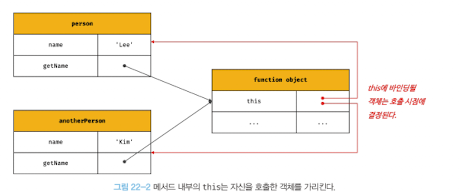

# 22. This

## 22.1 this 키워드

🔖 객체는 상태를 나타내는 프로퍼티와 동작을 나타내는 메서드를 하나의 논리적인 단위로 묶은 복합적인 자료구조

⇒ 이떄 메서드가 사진이 속한 객체의 프로퍼티를 참조하려면 **자신이 속한 객체를 가리키는 식별자를 참조할 수 있어야 한다.**

### ✅ 생성자 함수 방식

1. 생성자 함수로 인스턴스를 생성하기 위해서는 생성자 함수가 존재해야 함
2. 생성자 함수 정의 시점에는 인스턴스 생성 전이기 때문에 생성자 함수가 생성할 인스턴스를 가리키는 식별자를 알 수 없음
3. 자신이 속한 객체 또는 자신이 생성할 인스턴스를 가리키는 특수한 식별자 필요 ⇒ this

### ✨ this

자신이 속한 객체 또는 자신이 생성할 인스턴스를 가리키는 자기 참조 변수다.

this를 통해 자신이 속한 객체 또는 자신이 생성할 인스턴스의 프로퍼티나 메서드를 참조할 수 있다.

this가 가리키는 값, 즉 this 바인딩은 함수 호출 방식에 의해 동적으로 결정

### ✅ 객체 리터럴 방식의 this와 생성자 함수 방식의 this

✔️ 객체 리터럴 방식

```jsx
const circle = {
  radius: 5,
  getDiameter() {
    return 2 * this.radius;
  },
};

console.log(circle.getDiameter()); // 10
```

이때 this는 메서드를 호출한 객체, 즉 circle을 가리킴

✔️ 생성자 함수 방식

```jsx
function Circle(radius) {
  // this는 생성자 함수가 생성할 인스턴스를 가리킴
  this.radius = radius;
}

Circle.prototype.getDiameter = function () {
  // this는 생성자 함수가 생성할 인스턴스를 가리킴
  return 2 * this.radius;
};

const circle = new Circle(5);
console.log(circle.getDiameter()); // 10
```

이때 this는 생성자 함수가 생성할 인스턴스를 가리킴

## 22.2 함수 호출 방식과 this 바인딩

자바스크립트의 this는 함수가 호출되는 방식에 따라 this에 바인딩될 값, 즉 this 바인딩이 동적으로 결정된다.

strict mode 또한 this 바인딩에 영향을 준다.

✔️ 렉시컬 스코프는 함수 정의가 평가 되어 **함수 객체가 생성되는 시점**에 상위 스코프 결정 vs this 바인딩은 **함수 호출 시점**에 결정

### ✅ 일반 함수 호출

this에 전역 객체 바인딩

**✨ 일반 함수로 호출하면 함수 내부의 this에는 전역 객체가 바인딩 된다.**

**✨ 일반 함수, 중첩 함수, 콜백 함수 등 어떠한 함수라도 일반 함수로 호출되면 this에 전역 객체가 바인딩**

```jsx
var value = 1;

const obj = {
  value: 100,
  foo() {
    console.log("foo's this: ", this); // {value: 100, foo: f}
    console.log("foo's this.value: ", this.value); // 100

    // 메서드 내에서 정의한 중첩 함수
    // use strict를 사용했다면 undefined
    function bar() {
      console.log("bar's this: ", this); // window
      console.log("bar's this.value: ", this.value); // 1
    }

    bar();

    // 콜백 함수 내부의 this도 전역 객체 바인딩
    setTimeout(function () {
      console.log("callback's this: ", this); // window
      console.log("callback's this.value: ", this.value); // 1
    }, 100);
  },
};

obj.foo();
```

메서드 내부의 중첩 함수나 콜백 함수의 this 바인딩을 메서드의 this 바인딩과 일치시키기 위한 방법

```jsx
var value = 1;

const obj = {
  value: 100,
  foo() {
    // this 바인딩을(obj) 변수 that에 할당
    const that = this;

    // 콜백 함수 내부에서 this 대신 that을 참조
    setTimeout(function () {
      console.log(that.value); //100
    }, 100);
  },
};

obj.foo();
```

### ✅ 메서드 호출

소유한 객체가 아닌 메서드를 호출한 객체에 바인딩

```jsx
const anotherPerson = {
  name: "Kim",
};

// getName 메서드를 anotherPerson 객체의 메서드로 할당
anotherPerson.getName = person.getName;

// getName 메서드를 호출한 객체는 anotherPerson이다.
console.log(anotherPerson.getName()); // Kim => this는 anotherPerson

// getName 메서드를 변수에 할당
const getName = person.getName;

//getName 메서드를 일반 함수로 호출 => this는 전역 객체를 가리키게 됨
console.log(getName()); // window.name과 같다.=> 기본값은 '', Node 환경은 undefined
```



### ✅ 생성자 함수 호출

생성자 함수 내부의 this에는 생성자 함수가 (미래에 생성할) 인스턴스가 바인딩

### ✅ Function.prototype.apply/call/bind 메서드에 의한 간접 호출

```jsx
/**
* 주어진 this 바인딩과 인수 리스트 배열을 사용하여 함수를 호출
*/
Function.prototype.apply(thisArg[, argsArray])

/**
* 주어진 this바인딩과 , 로 구분된 인수 리스트를 사용하여 함수를 호출
*/
Function.prototype.call(thisArg[, arg1[, arg2[, ...]]])

```

1. apply와 call 메서드의 본질적인 기능은 함수를 호출하는 것

   ⇒ 대표적인 용도는 유사 배열 객체에 배열 메서드를 사용하는 경우 : arguments 객체는 배열이 아니기 때문에 apply와 call 메서드를 사용하면 가능

   ```jsx
   function getThisBinding() {
     console.log(arguments);
     return this;
   }

   const thisArg = { a: 1 };

   // 함수를 호출하면서 인수로 전달한 객체를 getThisBinding 함수의 this에 바인딩
   // 배열로 묶어 전달
   console.log(getThisBinding.apply(thisArg, [1, 2, 3]));

   // 리스트 형식으로 전달
   console.log(getThisBinding.call(thisArg, 1, 2, 3));
   ```

2. bind는 함수 호출 대신 첫 번째 인수로 전달한 값으로 this바인딩이 교체된 함수를 새롭게 생성해 반환

   ⇒ 메서드의 this와 내부 함수의 중첨함수 또는 콜백 함수의 this가 불일치하는 문제를 해결하기 위해 사용

   ```jsx
   function getThisBinding() {
     return this;
   }

   const thisArg = { a: 1 };

   // 첫 번째 인수로 전달한 값으로 this바인딩이 교체된 함수를 새롭게 생성해 반환
   console.log(getThisBinding.bind(thisArg));
   // 명시적으로 호출
   console.log(getThisBinding.bind(thisArg)()); // { a : 1 }
   ```

   ```jsx
   const person = {
     name: "Lee",
     foo(callback) {
       // bind 메서드로 callback 함수 내부의 this 바인딩을 전달
       setTimeout(callback.bind(this), 100);
     },
   };

   person.foo(function () {
     console.log(`Hi! my name is ${this.name}`); // Lee
   });
   ```

   | 함수 호출 방식                                             | this 바인딩                                                            |
   | ---------------------------------------------------------- | ---------------------------------------------------------------------- |
   | 일반 함수 호출                                             | 전역 객체                                                              |
   | 메서드 호출                                                | 메서드를 호출한 객체                                                   |
   | 생성자 함수 호출                                           | 생성자 함수가 미래에 생성할 인스턴스                                   |
   | Function.prototype.apply/call/bind 메서드에 의한 간접 호출 | Function.prototype.apply/call/bind 메서드에 첫 번째 인수로 전달한 객체 |
