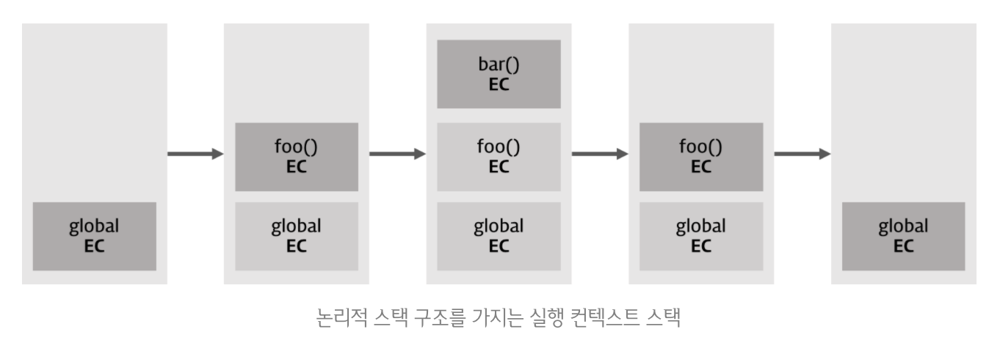

23. 실행 컨텍스트

## 23.1 소스코드의 타입

소스코드의 타입에 따라 실행 컨텍스트를 생성하는 과정과 관리 내용이 다름

### ✅ 전역 코드

최상위 스코프인 전역 스코프 생성

var 키워드로 선언된 전역 변수와 함수 선언문으로 정의된 전역 함수를 전역 객체와 연결

코드가 평가되면 전역 실행 컨텍스트 생성

### ✅ 함수 코드

지역 스코프를 생성하고 지역 변수, 매개변수, arguments 객체를 관리

생성한 지역 스코프를 전역 스코프에서 시작하는 스코프 체인의 일원으로 연결

코드가 평가되면 함수 실행 컨텍스트 생성

### ✅ eval 코드

strict 모드에서 자신만의 독자적인 스코프를 생성

코드가 평가되면 eval 실행 컨텍스트 생성

### ✅ 모듈 코드

모듈별로 독립적인 스코프 생성

코드가 평가되면 모듈 실행 컨텍스트 생성

## 23.2 소스코드의 평가와 실행

1. 평가

   1. 실행 컨텍스트 생성
   2. 변수, 함수 등의 선언문만 실행하여 변수나 함수 식별자를 키로 실행 컨텍스트가 관리하는 스코프에 등록\

   예) var x 실행 후, 실행 컨텍스트가 관리하는 스코프에 등록되고 undefined로 초기화

2. 실행 ⇒ 런타임

   1. 소스코드 실행에 필요한 정보, 즉 변수나 함수의 참조를 실행 컨텍스트가 관리하는 스코프에서 검색하여 취득
   2. 변수 값의 변경 등 소스코드의 실행 결과는 다시 실행 컨텍스트가 관리하는 스코프에 등록

   예) 실행 컨텍스트가 관리하는 스코프에 x 변수가 등록되어 있는지 확인 ⇒ 있다면 할당 결과를 실행 컨텍스트에 등록하여 관리

## 23.3 실행 컨텍스트의 역할

### ✅ 실행 컨텍스트

소스코드를 실행하는데 필요한 환경을 제공하고 실행 결과를 실제로 관리하는 영역

실행 컨텍스트는 **식별자(변수, 함수, 클래스 등의 이름)을 등록하고 관리하는 스코프**와 **코드 실행 순서 관리를 구현한 내부 메커니즘**으로, 모든 코드는 실행 컨텍스트를 통해 실행되고 관리된다.

✔️ 식별자와 스코프는 실행 컨텍스트의 렉시컬 환경으로 관리하고, 코드 실행 순서는 실행 컨텍스트 스택으로 관리

## 23.4 실행 컨텍스트 스택



실행 컨텍스트 스택은 코드의 실행 순서를 관리한다.

실행 컨텍스트 스택의 최상위에 존재하는 실행 컨텍스트는 언제나 현재 실행 중인 코드의 실행 컨텍스트다.

⇒ 최상위 실행 컨텍스트를 **실행 중인 실행 컨텍스트**라 부른다.

## 23.5 렉시컬 환경

스코프와 식별자를 관리

### ✅ 환경 레코드

스코프에 포함된 식별자를 등록하고 등록된 식별자에 바인딩된 값을 관리하는 저장소

환경 레코드는 소스타입에 따라 관리하는 내용에 차이가 있다.

### ✅ 외부 렉시컬 환경에 대한 참조

상위 스코프를 가리키는데, 이는 해당 실행 컨텍스트를 생성한 소스코드를 포함하는 상위 코드의 렉시컬 환경을 의미

외부 렉시컬 환경에 대한 참조를 통해 단방향 링크드리스트인 스코프 체인을 구현

## 23.6 실행 컨텍스트의 생성과 식별자 검색 과정

```jsx
var x = 1;
const y = 2;

function foo(a) {
  var x = 3;
  const y = 4;

  function bar(b) {
    const z = 5;
    console.log(a + b + x + y + z);
  }
  bar(10);
}

foo(20); // 42
```

### 1️⃣ 전역 객체 생성

전역 코드가 평가되기 이전에 생성

전역 객체에는 빌트인 전역 프로퍼티, 빌트인 전역 함수, 표준 빌트인 객체, 동작 환경에 따라 클라이언트 사이드 Web API(DOM, BOM, Canvas, XMLHttpRequest, fetch, SVG, Web Storage…) 또는 특정 환경을 위한 호스트 객체를 포함

### 2️⃣ 전역 코드 평가

1. 전역 실행 컨텍스트 생성
   1. 비어있는 전역 실행 컨텍스트 생성 및 실행 컨텍스트 스택에 푸시
2. 전역 렉시컬 환경 생성

   전역 렉시컬 환경을 전역 실행 컨텍스트에 바인딩

   1. 전역 환경 레코드 생성

      1. 객체 환경 레코드 생성

         전역 코드 평가 과정에서 var 키워드로 선언한 전역 변수와 함수 선언문으로 정의된 전역 함수는 전역 환경 레코드의 객체 환경 레코드에 연결된 BindingObject를 통해 **전역 객체의 프로퍼티와 메서드**가 된다.

         ⇒ 전역 객체를 가리키는 식별자 없이 전역 객체의 프로퍼티를 참조할 수 있는 매커니즘

         **✨ window에 var 와 함수 선언문이 코드 실행 단계에서 변수 선언문 이전에도 참조할 수 있는 이유(변수 호이스팅과 함수 호이스팅이 발생하는 원인)**

         **✨ 변수의 경우 변수 선언문 이전에 참조한 변수의 값은 언제나 undefined이지만, 함수는 생성된 함수 객체를 즉시 할당하여 함수 선언문 이전에 호출이 가능**

      2. 선언적 환경 레코드 생성

         let, const 키워드로 선언한 전역변수가 등록되고 관리되는 곳

         const의 경우 “선언 단계”와 “초기화 단계”가 분리되어 진행

         **✨ let 과 const도 호이스팅이 발생하는 것은 변함이 없으나, 런타임에 변수 선언문에 도달하기 전까지 일시적 사각지대에 빠지기 때문에 참조X**

   2. this 바인딩
   3. 외부 렉시컬 환경에 대한 참조

      외부 렉시컬 환경에 대한 참조는 현재 평가 중인 소스코드를 포함하는 외부 소스코드의 렉시컬 환경, 즉 상위 스코프를 가리킴

      **✨ 전역 코드를 포함하는 소스코드는 없기에 전역 렉시컬 환경의 외부 렉시컬 환경에 대한 참조에 null이 할당 ⇒ 전역 렉시컬 환경이 스코프 체인의 종점에 존재함을 의미**

### 3️⃣ 전역 코드 실행

식별자 결정을 위해 식별자를 검색할 때는 실행 중인 실행 컨텍스트에서 식별자를 검색하기 시작

만약 실행 중인 실행 컨텍스트의 렉시컬 환경에서 식별자를 검색할 수 없으면 외부 렉시컬 환경에 대한 참조가 가리키는 렉시컬 환경, 즉 상위 스코프로 이동하여 식별자를 검색

❗️전역 레시컬 환경은 스코프 체진의 종점이므로 전역 렉시컬 환경에서 검색할 수 없는 식별자는 참조 에러(ReferenceError)를 발생시킴

### 4️⃣ foo 함수 코드 평가

1. 함수 실행 컨텍스트 생성
   1. 실행 컨택스트 스택에 푸시
2. 함수 렉시컬 환경 생성

   foo 함수 렉시컬 환경 생성 후 foo 함수 실행 컨텍스트에 바인딩

   1. 함수 환경 레코드 생성

      매개변수, arguments 객체, 함수 내부에서 선언한 지역 변수와 중첩 함수를 등록하고 관리

   2. this 바인딩
   3. 외부 렉시컬 환경에 대한 참조 결정

      **함수를 어디서 호출했는지가 아니라 어디에 정의했는지에 따라 상위 스코프를 결정**

      ❗️함수의 상위 스코프를 함수 객체의 내부 슬롯에 저장 ⇒ 함수 객체의 내부 슬롯 `[[environment]]` 가 렉시컬 스코프를 구현하는 메커니즘

### 5️⃣ foo 함수 코드 실행

식별자 결정을 위해 실행 중인 실행 컨텍스트의 렉시컬 환경에서 식별자를 검색하기 시작

없을 경우 외부 렉시컬 환경에서 대한 참조가 가리키는 렉시컬 환경으로 이동하여 식별자를 검색

### 5️⃣ bar 함수 코드 평가

### 6️⃣ bar 함수 코드 실행

1. console 식별자 검색

   bar 실행 컨텍스트 X → foo 실행 컨텍스트 X → 전역 객체

2. log 메서드 검색
3. 표현식 a + b + x + y + z의 평가

   a는 foo 함수 렉시컬 환경에서, b 는 bar 함수 렉시컬 환경에서, x와 y는 foo 함수 렉시컬 환경에서, z 는 bar 함수 렉시컬 환경에서 검색

### 7️⃣ bar 함수 코드 실행 종료

실행 컨텍스트 스택에서 pop

실행 컨텍스트가 소멸되었다고 하더라도 만약 bar 함수 렉시컬 환경을 누군가 참조하고 있다면 bar 함수 렉시컬 환경은 소멸X

### 8️⃣ foo 함수 코드 실행 종료

### 9️⃣ 전역 코드 실행 종료
