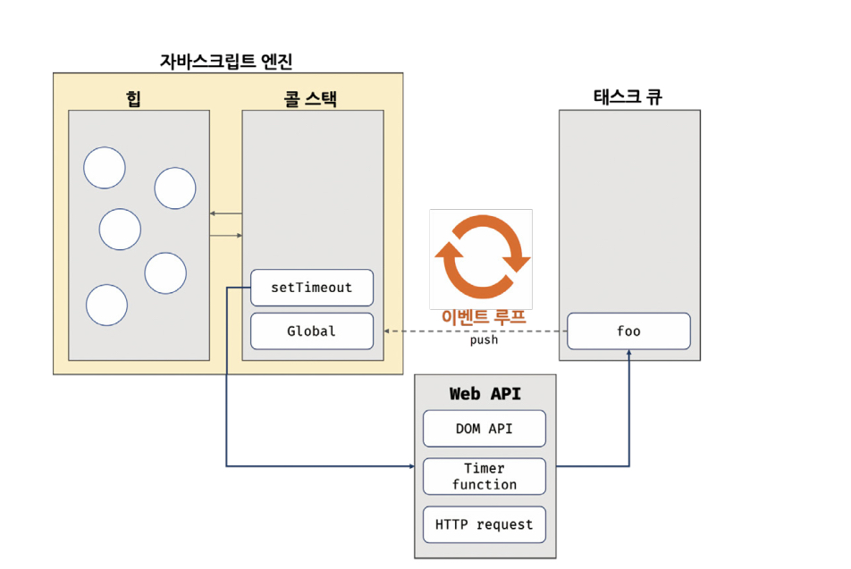

# 42. 비동기 프로그래밍

## 42.1 동기 처리와 비동기 처리

✅ 자바스크립트 엔진은 단 하나의 실행 컨텍스트 스택을 갖는다.

✅ 한 번에 하나의 태스크만 실행할 수 있는 **싱글 스레드** 방식으로 동작

⇒ 한 번에 하나의 태스크만 실행할 수 있기 때문에 처리에 시간이 걸리는 태스크를 실행하는 경우 블로킹(작업 중단)이 발생

✅ 동기 처리: 실행 중인 태스크가 종료할 때까지 다음에 실행될 태스크가 대기하는 방식

⇒ 실행 순서는 보장되지만, 앞선 태스크가 종료될 때까지 이후 태스크들이 블로킹 되는 단점

✅ 비동기 처리: 현재 실행 중인 테스크가 종료되지 않은 상태라 해도 다음 태스크를 곧바로 실행하는 방식

⇒ 블로킹이 발생하지 않지만, 태스크 실행 순서가 보장되지 않는다는 단점

**✨ 타이머 함수인 setTimeout과 setInterval, HTTP 요청, 이벤트 핸들러는 비동기 처리 방식으로 동작**

## 42.2 이벤트 루프와 태스크 큐

✅ 이벤트 루프 : 자바스크립트의 동시성을 지원하는 것 (브라우저 내장 기능)

비동기 처리에서 소스코드의 평가와 실행을 제외한 모든 처리는 자바스크립트 엔진을 구동하는 환경인 브라우저 또는 Node.js가 담당

✅ 태스크 큐

setTimeout이나 setInterval과 같은 비동기 함수의 콜백 함수 또는 이벤트 핸들러가 일시적으로 보관되는 영역

✅ 이벤트 루프

콜 스택에 현재 실행 중인 실행 컨텍스트가 있는지, 그리고 태스크 큐에 대기 중인 함수가 있는지 반복해서 확인

콜 스택이 비어있고 태스크 큐에 대기 중인 함수가 있다면 이벤트 루프는 순차적(FIFO)으로 태스크 큐에 대기 중인 함수를 콜 스택으로 이동 시킴 ⇒ 콜스택으로 이동한 함수는 실행되지만, 태스크 큐에 일시 보관된 함수들은 비동기 처리 방식으로 동작

✅ 싱글 스레드 방식의 자바스크립트

싱글 스레드 방식으로 동작하는 것은 브라우저가 아니라 브라우저에 내장된 자바스크립트 엔진

**즉, 자바스크립트 엔진은 싱글 스레드로 동작하지만 브라우저는 멀티 스레드로 동작**
