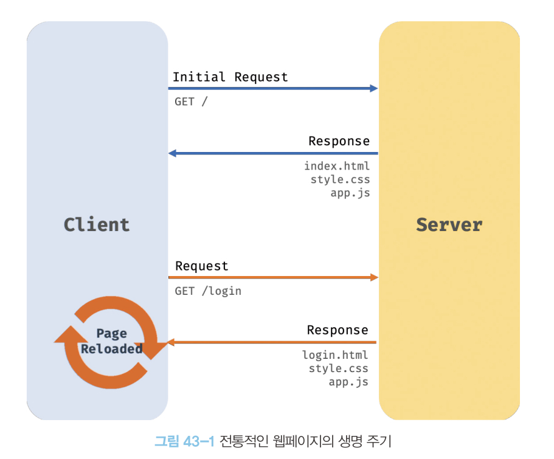
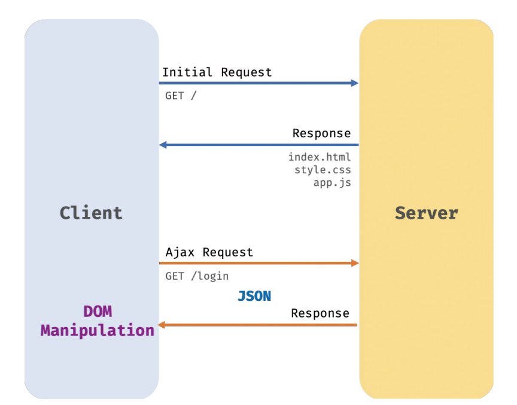

## 43.1 Ajax란

✅ Ajax란 자바스크립트를 사용하여 브라우저가 서버에게 비동기 방식으로 데이터를 요청하고, 서버가 응답한 데이터를 수신하여 웹페이지를 동적으로 갱신하는 프로그래밍

✅ 브라우저 제공 Web API인 XMLHttpRequest 객체를 기반을 동작



**🔴 전통적인 방식**

1. 이전 웹페이지에서 변경할 필요가 없는 부분까지 포함된 HTML을 서버로부터 매번 전송받아서 불필요한 데이터 총신이 발생
2. 변경할 필요가 없는 부분까지 처음부터 다시 랜더링 ⇒ 화면 깜빡이는 현상 발생
3. 클라이언트와 서버와의 통신이 동기 방식으로 동작하기 때문에 서버로부터 응답이 있을 때까지 다음 처리는 블로킹



**✅ Ajax**

1. 변경할 부분을 갱신하는데 필요한 데이터만 서버로부터 전송받기 때문에 불필요한 데이터 통신이 발생하지 않음
2. 변경할 필요가 없는 부분은 리랜더링 하지 않음 ⇒ 화면 깜박임 없음
3. 클라이언트와 서버와의 통신이 비동기 방식으로 동작하기 때문에 서버에게 요청을 보낸 이후 블로킹 발생X

## 43.2 JSON

**✅ JSON(JavaScript Object Notation)**

클라이언트와 서버간의 HTTP 통신을 위한 텍스트 데이터 포맷

자바스크립트에 종속되지 않는 언어 독립형 데이터 포맷

**✅ JSON.stringify**

객체를 JSON 포맷의 문자열로 변환 ⇒ 직렬화

객체 뿐만 아니라 배열도 가능

**✅ JSON.parse**

JSON 포맷의 문자열을 객체로 변환 ⇒ 역직렬화

## 43.3 XMLHttpRequest

### **✅ XMLHttpRequest 객체 생성**

생성자 함수를 호출해 생성

```jsx
const xhr = new XMLHttpRequest();
```

### **✅ HTTP 요청 전송**

1. XMLHttpRequest.prototype.open 메서드로 HTTP 요청 초기화
2. 필요에 따라 XMLHttpRequest.prototype.setRequestHeader 메서드로 특정 HTTP 요청의 헤더 값을 설정
3. XMLHttpRequest.prototype.send 메서드로 HTTP 요청을 전송

```jsx
const xhr = new XMLHttpRequest();

xhr.open("GET", "/users");

xhr.setRequestHeader("content-type", "application/json");

xhr.send();
```

**✨ XMLHttpRequest.prototype.send**

- GET: 데이터를 URL의 일부분인 쿼리 문자열로 서버에 전송
- POST: 데이터(페이로드)를 Request body에 담아 전송

👌 HTTP 요청 메서드가 GET인 경우 send 메서드에 페이로드로 전달한 인수는 무시되고 Request body는 null로 설정된다.
